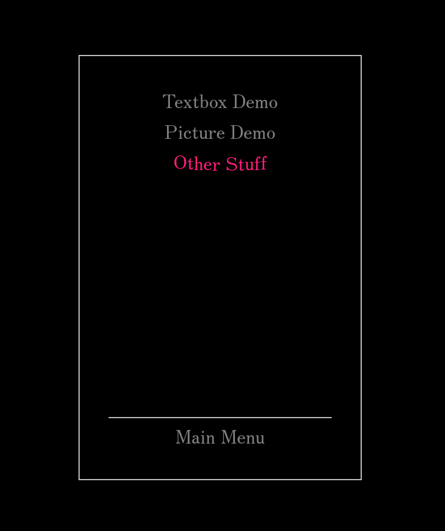

# Silver Window

A visual editor within Godot 4.0.4 for displaying text and images in the style of the Silver Case games (the Film Window engine).

(Disclaimer: This project has no affiliation with the Silver Case, the Film Window engine, or Grasshopper Manufacture. It merely attempts to recreate the look and feel of the Silver Case games. No code or assets have been taken from the Silver Case or the Film Window engine.)

## Demo Game

A demo game made using the editor is available here:
https://hai-taka.itch.io/silver-window-editor-demo

The demo shows off the various features of the editor and doubles as a tutorial. It is recommended to go through it before using the editor.

The JSON scripts from the demo are included in the project files.

## Installation

This project was made with Godot 4.0.4. It has not been tested on newer versions of Godot.

You can get Godot 4.0.4 here:
https://godotengine.org/download/archive/4.0.4-stable/

Once you have Godot set up, copy the Silver Window repository to your machine and import the project file into Godot.

## How to use

### Visual Editor

To get started, open the visual editor scene (`visual-editor.tscn`) and run it. You'll see the following empty GraphEdit interface.

There are four types of nodes in the visual editor: Dialogue Nodes, Picture Nodes, Update Nodes, and Transition Nodes. Dialogue Nodes are used to display textboxes and portraits. Picture Nodes are used to display all other images. Update Nodes are used to update the properties of a Picture Node after it has been created. Transition Nodes are used to connect one dialogue script to the next. 

The editor works by chaining together Dialogue Nodes to create a dialogue script (JSON file). Each script starts with a head Dialogue Node and ends with a Transition Node. Along the way, you can connect Picture Nodes to display images.

Each click / button press from the user advances the script from one Dialogue Node to the next.

New nodes can be added by either right-clicking anywhere in the editor or selecting "Node" in the toolbar.

The JSON file can be previewed by clicking the play button.

**Tip:** The editor can be panned around by clicking and holding the mouse wheel.

## Customization

Colors and widths can  be customized from within the editor.

To change the textbox font, change the RichTextLabel `normal_font` property of the `window_theme` theme.

To change the menu colors, set the various properties in the `main_menu_colors` resource in the `main_menu.tscn` scene.

All sounds can be changed by editing `singletons/sound_manager.tscn`.

If you add or remove assets, make sure to update the credits section in the options menu.

## Chapters

The editor workflow is as follows: chain Dialogue Nodes together to create a dialogue script (JSON file); chain dialogue scripts together using Transition Nodes to create a chapter; mark the end of a chapter by toggling `End Card` on the final script's Transition Node.

To add a chapter to the game, add the path to the first JSON file of the chapter to the `first_script_list` array in `singletons/global_data.gd`. Chapter names are set in the `chapter_list` array.

A demo game consisting of three chapters is including in the project.

Left-click / spacebar is used to advance the text.

Escape brings up the pause menu.

An options menu and a save / load system are included in the project.

## Contact

If you have any questions about using the editor, email me at haitaka_silver@proton.me

## License

Silver Window is released under the MIT License. Any further attribution beyond the inclusion of the license is unnecessary but appreciated.

## Attributions

Typing sounds modified from:

Brother_Center.WAV by fastson -- https://freesound.org/s/99693/ -- License: Attribution 3.0
https://creativecommons.org/licenses/by/3.0/

electric typewriter.wav by Tomlija -- https://freesound.org/s/96925/ -- License: Attribution 3.0
https://creativecommons.org/licenses/by/3.0/

printer.wav by lezaarth -- https://freesound.org/s/232728/ -- License: Creative Commons 0
https://creativecommons.org/publicdomain/zero/1.0/

Other sounds:

warble376_01 by BriarSMC -- https://freesound.org/s/717337/ -- License: Creative Commons 0
https://creativecommons.org/publicdomain/zero/1.0/

Music:

Piano loops 156 efect octave long loop 120 bpm by josefpres -- https://freesound.org/s/736586/ -- License: Creative Commons 0
https://creativecommons.org/publicdomain/zero/1.0/

Crime syndicates by Gustavo_Alivera -- https://freesound.org/s/736624/ -- License: Creative Commons 0
https://creativecommons.org/publicdomain/zero/1.0/

Images:

Photo by Neven Krcmarek on StockSnap
https://stocksnap.io/photo/dark-moon-K4MUDM2QKG
https://creativecommons.org/publicdomain/zero/1.0/

Photo by Edgar Chaparro on Unsplash
https://unsplash.com/photos/brown-wooden-shelf-with-bottles-Lwx-q6OdGAc
https://unsplash.com/license

Silver Font by Poppy Works

https://poppyworks.itch.io/silver
Attribution 4.0 International (CC BY 4.0)
https://creativecommons.org/licenses/by/4.0/

Boxicons

https://boxicons.com/

The MIT License (MIT)

Copyright (c) 2015-2021 Aniket Suvarna

Permission is hereby granted, free of charge, to any person obtaining a copy of this software and associated documentation files (the “Software”), to deal in the Software without restriction, including without limitation the rights to use, copy, modify, merge, publish, distribute, sublicense, and/or sell copies of the Software, and to permit persons to whom the Software is furnished to do so, subject to the following conditions:

The above copyright notice and this permission notice shall be included in all copies or substantial portions of the Software.

THE SOFTWARE IS PROVIDED “AS IS”, WITHOUT WARRANTY OF ANY KIND, EXPRESS OR IMPLIED, INCLUDING BUT NOT LIMITED TO THE WARRANTIES OF MERCHANTABILITY, FITNESS FOR A PARTICULAR PURPOSE AND NONINFRINGEMENT. IN NO EVENT SHALL THE AUTHORS OR COPYRIGHT HOLDERS BE LIABLE FOR ANY CLAIM, DAMAGES OR OTHER LIABILITY, WHETHER IN AN ACTION OF CONTRACT, TORT OR OTHERWISE, ARISING FROM, OUT OF OR IN CONNECTION WITH THE SOFTWARE OR THE USE OR OTHER DEALINGS IN THE SOFTWARE.

Some RichTextEffect code modified from code originally created by teebarjunk

https://github.com/teebarjunk/godot-text_effects

MIT License

Copyright (c) 2020 teebarjunk

Permission is hereby granted, free of charge, to any person obtaining a copy
of this software and associated documentation files (the "Software"), to deal
in the Software without restriction, including without limitation the rights
to use, copy, modify, merge, publish, distribute, sublicense, and/or sell
copies of the Software, and to permit persons to whom the Software is
furnished to do so, subject to the following conditions:

The above copyright notice and this permission notice shall be included in all
copies or substantial portions of the Software.

THE SOFTWARE IS PROVIDED "AS IS", WITHOUT WARRANTY OF ANY KIND, EXPRESS OR
IMPLIED, INCLUDING BUT NOT LIMITED TO THE WARRANTIES OF MERCHANTABILITY,
FITNESS FOR A PARTICULAR PURPOSE AND NONINFRINGEMENT. IN NO EVENT SHALL THE
AUTHORS OR COPYRIGHT HOLDERS BE LIABLE FOR ANY CLAIM, DAMAGES OR OTHER
LIABILITY, WHETHER IN AN ACTION OF CONTRACT, TORT OR OTHERWISE, ARISING FROM,
OUT OF OR IN CONNECTION WITH THE SOFTWARE OR THE USE OR OTHER DEALINGS IN THE
SOFTWARE.
